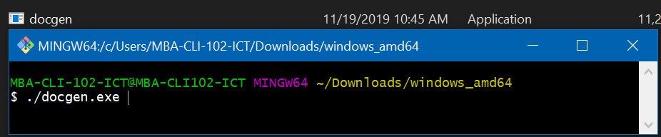

# Documenting API with DOCGEN

This is a simple step by step to getting started with DOCGEN on windows.

### Step 1

- Open POSTMAN 
    - Add Environment: starkmart
        - set VARIABLE: URL
        - set INITIAL VALUE: http://localhost/starkmart/api
        - set CURRENT VALUE: http://localhost/starkmart/api

### Step 2

- In Manage Environment:
  - Select 'starkmart' and
  - Replace url field string: 'http://localhost/starkmart/api' with {{URL}}

### Step 3

- Ensure that all API ENDPOINTS are tested and working perfectly.

### Step 4

- Click on the Collection created and click 'Publish Docs'.

### Step 5

- Select Environment: 'starkmart', on the browser opened.

### Step 6

- Click on the Collection created
    - click 'Export', 
    - select Collection v2.1 (recommended)

### Step 7

- Install Windows Docgen Binary - https://github.com/thedevsaddam/docgen-bin

### Step 8

- Extract, and install via terminal 
    - Ensure you open the terminal at the path of the docgen exe file.

### Step 9

- To make HTML documentation use: 
    - ./docgen build -i starkmart.postman_collection -o index.html.

### Step 10

- open the html file generated.

### Walla, we done in just 10 steps
